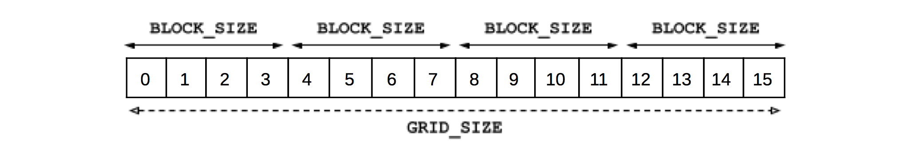

# CUDA Laboratory 1

_Introduction to High-Performance Computing_

## Introduction

In this first laboratory about GPU programming in CUDA, we are going to
introduce you to the very basic concepts you need to start programming your
own GPU-accelerated applications. The laboratory is divided into two different
blocks and exercises, for your own convenience:

+ **Block A (Friday / 23<sup>th</sup> of August)**: The first block aims to provide you with
  a first notion on how to use CUDA. This includes how to compile a CUDA
  program, how to launch a CUDA kernel, how to index 1D arrays, and more.

+ **Block B (Monday / 26<sup>th</sup> of August)**: The second block presents a use-case
  for using GPUs with images. The goal is to make you understand how to index
  2D matrices, while doing something practical.

A step-by-step guide is always provided on each exercise of both blocks. **You
will find one or more TO-DO steps (with questions) that you need to
address in order for the exercise to be considered complete.** When you find one
of these subsections, our advice is to stop reading the following paragraph and
address as much as you can. The exercises are relatively simple, do not worry.
Our objective is to help you understand the concepts being explained.

For all the exercises, we are going to use Tegner. 

> Even though you may have a laptop with a CUDA-supported GPU, we encourage you
> to use Tegner during the sessions of today and Monday.

Tegner is a cluster at KTH
Royal Institute of Technology with 65 heterogeneous nodes. Every node has one
or two GPUs, based on the NVIDIA Quadro K420 or the NVIDIA Tesla K80. For the
purposes of this laboratory, we will use the "Thin Nodes" of Tegner.
These nodes contain 2&times;12-core Intel E5-2690v3 CPUs at 2.60GHz, 512GB DRAM and
NVIDIA Quadro K420 GPU per node. More information can be found
[here](https://www.pdc.kth.se/hpc-services/computing-systems/tegner-1.737437).

Everyone should try to finish the first block of the laboratory, otherwise it
would be difficult to complete the second block in the next laboratory session
of Monday. Ideally, the first block is designed to be completed during the
first session of CUDA (today), while the second block targets the second part
(after the weekend). Take your time, it is important for you to try to
understand the key-concepts presented on this session.

<span style="color:red">**Please note!**</span>  In case you need help or you
do not understand some of the concepts of CUDA, do not worry, we are here to
help you out!

## Block A

In this first block of the laboratory, we are going to introduce you to the
world of GPU programming using CUDA. We will begin explaining how to connect to
Tegner, as well as how to compile and run a given program. Thereafter, we will
ask you to create your first CUDA program using a CPU implementation of a SAXPY
function as reference.

### Exercise 1 - Experimental Setup

We will begin our laboratory learning how to connect to Tegner and ask for a
GPU resource on the cluster. First, ask for your Kerberos ticket using the
kinit command, as usual:

```
kinit --forwardable your_username@NADA.KTH.SE
```

Replace ``your_username`` with the username that was provided to you by PDC (i.e.,
the one you have used for the previous sessions). After this, you can now
connect to Tegner using SSH:

```
ssh -Y your_username@tegner.pdc.kth.se
```

You need to add the flag -Y to ask for X11 forwarding support. This is not
required for this first block of exercises, but it will be important for the
second block of the laboratory session on Monday. We will provide more details
afterwards.

Once you are connected, clone the cuda exercise repository in your Klemming folder:

```
cd /cfs/klemming/nobackup/your_initial/your_username
module load git
git clone https://github.com/PDC-support/cuda-lab-exercises.git
cd cuda-lab-exercises/lab_1/C
```

Inside the extracted folder, you will find two files named
``lab01_ex1.cu`` and ``lab01_ex2.cu``. You must use these two files for solving the
exercises of this first block. As you might have noticed, the source files of
CUDA programs have the extension "cu". This is a mere naming
convention to identify your different GPU-based source code files. It is also a
good way for other programmers to understand that the file contains CUDA code.

**Let us now compile and run the lab01\_ex1.cu file.** This file
contains a very simple (yet very important) "Hello World!" CUDA program. We
will ask you to solve some issues with this exercise later below.

---
**TO-DO [1.1]**

Open the file ``lab01_ex1.cu`` with your preferred text editor and examine its
content. Pay attention on how the the CUDA kernel ``gpu_helloworld()`` is launched
with the triple-bracket ``<<<>>>`` notation. Also, observe the declaration of the
kernel with ``__global__``.

---

As you have observed, the source code of the mentioned file is easy to follow.
Here, we just print a certain text using the ``printf()`` function, both in the CPU
version and the GPU version. However, for the GPU version, we also print the
thread identifier. The CUDA kernel is launched with 1 block of 32 threads, so
we simply have to use the predefined ``threadIdx`` constant on the X direction. In
other words, we are declaring the grid dimension as ``grid(1)`` and the block
dimension as ``block(32)``. Given the fact that the base type for each variable is
``dim3``, this means that we are implicitly creating a grid of blocks in the (X, Y,
Z) direction with a value 1 for Y and Z by default. The declaration of the
example is equivalent to the following:

```
dim3 grid(1,1,1); // 1 block in the grid
dim3 block(32,1,1); // 32 threads per block
```

This represents exactly what we had before (i.e., a grid of one block, whose
number of threads per block is 32 in the X direction). Understanding the way
indices work in CUDA is not trivial, so do not worry if you are a little bit
confused. The whole purpose of this first laboratory of CUDA is to make you
understand this concept. We will force you to practice throughout the document.

To compile the ``lab01_ex1.cu`` example, you need to load the CUDA module. This
will also load all the necessary CUDA dependencies:

```
module load cuda/7.0
```

To compile CUDA programs, we will use the ``nvcc`` command. This is a proprietary
NVIDIA compiler for CUDA that separates the host code (CPU code) from the GPU
code. The compiler will invoke GCC or ICC for the host code, as necessary. For
you, the only consideration is to use this compiler when you declare CUDA code
in your files, as follows:

```
nvcc -arch=sm_30 lab01_ex1.cu -o lab01_ex1.out
```

The previous command asks ``nvcc`` to compile ``lab01_ex1.cu`` and to generate a binary
executable named ``lab01_ex1.out``. The example also requests support for the
feature version of CUDA architecture 3.0 (i.e., ``sm_30``). This is required to
distinguish old generations of graphic cards with new releases, that contain
extra features. This does not mean that your code will not run if you do not
provide this flag, but it is likely that many of the features that you plan to
use in CUDA today are only available on the latest architectures.

Now, let us allocate one node on Tegner to run our program. We need to ask
``salloc`` for the type of nodes that we want, which will be the "Thin
Nodes" of Tegner (i.e., ``-C Haswell``) :

```
salloc --nodes=1 -C Haswell --gres=gpu:K420:1 -t 00:05:00 \
       -A account_here --reservation=reservation_here
```

Here, we are asking for 5 minutes of computation time on one single node of the
"Thin Nodes" of Tegner. In addition, we are specifying that we want to
get access to the GPU resource of the node with the ``--gres=gpu:K420:1`` option.

---
**NOTE**

Please, always ask for a node with ``salloc`` when your code compiles without
errors and you would like to run your program on Tegner. After you finish
executing and if you are not going to run anything for some time (e.g., between
each exercise), type exit to reclaim your allocation and allow other students
to get quick access to the cluster. This way, we will efficiently share the
resources and everyone will be able to run immediately.

---

After you get the node, you must use srun to execute the program and ask for a
single process:

```
srun -n 1 ./lab01_ex1.out
```

You might be thinking: "Wait a second, only 1 process!? But we said 32
threads before!". Yes, you are right, this is the confusing part. We are
going to parallelize the code using the local GPU of the node, and we are not
interested on using more nodes or more CPU processes. In the future, you could
use MPI with two or more processes, and create a massive parallel application
by using the GPU on each node. For now, we just want a single process that has
access to the GPU, but within the GPU we will request 32 threads. Check the
slides for an explanation on the differences between OpenMP, MPI and CUDA if
you feel this is still tricky to understand.

If everything went as expected, you should see the following output:

```
Hello from the CPU!
Hello from the GPU! My threadId is 0
Hello from the GPU! My threadId is 1
Hello from the GPU! My threadId is 2
...
Hello from the GPU! My threadId is 29
Hello from the GPU! My threadId is 30
Hello from the GPU! My threadId is 31
```

Were you able to see the suggested output? If not, can you guess why only the
CPU code generated the output?

---
**TO-DO [1.2]**

Open ``lab01_ex1.cu`` and find the commented "TO-DO #1.2" section in the code
to introduce the necessary fixes to make the code work as expected.

+ Hint #1: Is the kernel execution synchronous or asynchronous?
+ Hint #2: Could this [https://goo.gl/J5j44F](https://goo.gl/J5j44F) be useful?

---

One of the main concepts that you must understand while programming GPUs is
that, for the most part, the GPU code runs asynchronously with respect to the
CPU code. This is exactly what we observed in ``lab01_ex1.cu``, where even though
we set all the necessary elements correctly, the CUDA kernel always begins
execution while the CPU code is exiting the ``main()`` function. Without a proper
synchronization call, the CPU program finishes and no one will wait to see the
output coming from the GPU kernel.

As suggested, ``cudaDeviceSynchronize()`` can fix the issue. However, you must keep
in mind that other functionality of CUDA also enforce synchronization points
implicitly, such as ``cudaMemcpy()``. If any of these functions are defined in your
code after you launch a CUDA kernel, then you do not need to set a
synchronization point with ``cudaDeviceSynchronize()``.

### Exercise 2 - Your First CUDA Program

Now that you understand how to compile and run a simple CUDA program, in this
exercise we ask you to create your very first CUDA kernel and to introduce some
of the functionality required for this kernel to work. This includes defining
the distribution of the threads or adding memory management operations to
transfer data from the host memory to the GPU, and back. We will use host or
CPU to refer to the CPU space.

For this purpose, **we will implement a simple SAXPY program**. SAXPY is very
suitable to make you understand how to index 1D arrays inside a GPU kernel. The
term stands for "Single-Precision A\*X Plus Y", where A is a constant,
and X and Y are arrays.

---
**TO-DO [2.1]**

Open the file ``lab01_ex2.cu`` with your preferred text editor and examine its
content. In particular, make sure you understand the ``cpu_saxpy()`` function. We
will use this function as reference for the GPU version later in the exercise.

---

We will use the file ``lab01_ex2.cu`` for solving the exercise. The source code
contains a ``main()`` function that allocates two arrays, x and y, and initializes
each element of the array with 0.1 and 0.2, respectively. It is expected that
the user provides the value of the constant "a" as input for the
program. The size of each array is predefined with the constant ``ARRAY_SIZE``.
Right now, the program only calls ``cpu_saxpy()`` to compute the SAXPY result using
the CPU, but later you will introduce a call to the GPU version as well.
Finally, the code generates a naive hash of the result of both versions. This
will be used at the end of the execution to compare the solutions of the CPU
version and the GPU version.

We are going to introduce small changes into the source code of ``lab01_ex2.cu`` to
allow for a SAXPY version on the GPU. As a rule of thumb, every CUDA program is
usually defined by following these simple five steps:

1. **Declare and implement the CUDA kernel** that you would like to execute on the
GPU.
2. **Define the distribution of the threads**, in terms of the dimension of the
grid and the dimension of each block (of threads) inside the grid.
3. **Declare and define the GPU memory required** to execute the CUDA kernel. This
includes transferring the data from the host to the GPU, if needed.
4. **Execute the CUDA kernel** with the correspondent parameters.
5. **Transfer the results from the GPU** to the host. Alternatively, use a
synchronization function to guarantee that the host waits for the GPU to
execute the kernel.

In this exercise, we changed the order of some of these steps just so that we
force you to think on the main CUDA concepts. For instance, we will ask you to
implement the content of the kernel at the end of this exercise. The reason is
that we consider more relevant for you to initially understand how the
execution flow from the CPU to the GPU (and back) works. Thus, we are going to
focus inside the ``main()`` function to enable the execution of the CUDA kernel.

First, let us define how many threads will be needed to compute the CUDA
kernel. We suggest you to use the constant ``ARRAY_SIZE`` to calculate the number
of blocks (of threads) to be used. For the block dimension, use only the
constant ``BLOCK_SIZE``. These two constants are defined on top of the file. Note
that, as we are using only 1D arrays, it is enough for you to define the
dimensions in terms of the X dimension only. You can check ``lab01_ex1.cu``, as
reference.

For instance, imagine that we have an ``ARRAY_SIZE`` of 16 elements. By using a
``BLOCK_SIZE`` of 4, we can configure the execution to use 4 blocks in the grid and
on the X direction only:



Inside the CUDA kernel, the GPU will provide us with chunks of ``BLOCK_SIZE``
threads. We will need to use this dimension afterwards to determine which
elements we have to access for each array of SAXPY. As a side note, we
displayed in the figure a ``GRID_SIZE`` constant, but the purpose is to reflect the
size of the grid.

Developing a CUDA kernel requires a substantial mindset change from the
traditional CPU programming. The main one is the inherently absence of loops,
in favor of massively parallel number of threads that perform very small tasks
on specific elements of the data instead. In this case, we ideally want one
thread per element on each array. For now, try to concentrate on dividing the
workload assuming this fact. We will handle the specific details of thread
parallelism afterwards inside the SAXPY kernel.

---
**TO-DO [2.2]**

Find the "TO-DO #2.2" section inside ``lab01_ex2.cu`` and declare the grid and
block dimensions that will be used to launch the CUDA kernel of SAXPY. We
suggest you to request enough threads for the GPU to cover all the elements of
each array at once. Do not worry if you request more threads than elements in
the array, but try to fit the value.

+ Hint #1: Use the constant ``ARRAY_SIZE`` to determine how many blocks of
  threads in the X direction you will need.
+ Hint #2: Use the constant ``BLOCK_SIZE`` to define the number of threads in
  the X direction, per block.
+ Hint #3: For correctness, consider that the ``ARRAY_SIZE`` might not be
  multiple of the ``BLOCK_SIZE``.

---

After the grid and block dimensions are defined, the next step would be to
declare the device pointers that contain the elements of x and y, but on the
GPU side. The constant "a" can be passed by value to the CUDA kernel,
so no changes are required in this regard. We recommend you to always use the
prefix ``d_`` for the device-related pointers, as a good naming
convention. For instance, in this case, we should use ``d_x`` and ``d_y`` for the
device pointers that contain the elements of their equivalent x and y arrays in
the CPU:

```
float *d_x = NULL;
float *d_y = NULL;
```

Declaring only the ``d_x`` and ``d_y`` pointers will not seem to provide that much
value to your SAXPY kernel afterwards. The main reason is that we also need to
explicitly allocate each array on the GPU side. Thus, even though the arrays x
and y are already allocated on the host side, we should account for the fact
that the memory visible to the CPU is not visible to the GPU. 

> The Unified Memory Model of CUDA is an exception. This model manages the data
> transfer from the host to the GPU, and back, in an automatic manner. In this
> laboratory session, we use the classical model, where the memory management is
> up to the programmer. This also has benefits for performance.

Moreover, the content of each array must be manually transferred from the host
side (i.e., we want to define the device arrays to contain the same elements as
in the CPU version).

---
**TO-DO [2.3]**

Find the "TO-DO #2.3.1" section inside ``lab01_ex2.cu`` and declare the device
pointers ``d_x`` and ``d_y`` of type float. Thereafter, look for the
"TO-DO #2.3.2" section and allocate the arrays on the GPU. Do not forget to copy the
content of each array from the host side!

+ Hint #1: Use the constant ``ARRAY_SIZE`` to determine the size of each array
  (in bytes).
+ Hint #2: Use the memory management functions of CUDA
  [https://goo.gl/8VC46E](https://goo.gl/8VC46E) and
  [https://goo.gl/vcxdKi](https://goo.gl/vcxdKi).

---

After the arrays have been allocated on the GPU and its content transferred
from the CPU side, we are going to finish setting up the launch of the kernel
inside the ``main()`` function. The last steps would be to execute the kernel using
the grid and block dimensions that you defined earlier. We must also set the
device pointers ``d_x`` and ``d_y`` that you just allocated and filled with the content
from the host. Once again, check ``lab01_ex1.cu`` as reference.

---
**TO-DO [2.4]**

Find the "TO-DO #2.4" section inside ``lab01_ex2.cu`` and introduce the
necessary changes to launch the SAXPY kernel. Assume that the name of the
kernel is ``gpu_saxpy()`` and that the input parameters follow the interface of
the CPU version, but using ``d_x`` and ``d_y`` instead.

+ Hint #1: The triple-bracket ``<<<>>>`` notation is always required when calling a CUDA kernel.
+ Hint #2: Constants can be passed by value to a CUDA kernel, without any additional changes.

---

After we have defined the allocations on the GPU and established the launch of
the SAXPY kernel, we will introduce the last two changes to the ``main()``
function. The first one is to copy the result of the kernel from the GPU to the
host. Following the CPU implementation, assume that the result will be stored
on the ``d_y`` array. You can use the same ``cudaMemcpy()`` memory copy function as in
the previous steps, but making sure in this case that the order of the copy is
reversed. For the second change, we ask you to release the memory of each
device pointer at the end of the ``main()`` function. The source code currently
only releases the x and y arrays.

---
**TO-DO [2.5]**

Find the "TO-DO #2.5.1" section inside ``lab01_ex2.cu`` and copy the result
from ``d_y`` to ``y``. After this, find the "TO-DO #2.5.2" section and release
the device arrays ``d_x`` and ``d_y`` before the end of the ``main()`` function.

+ Hint #1: The order of the copy with ``cudaMemcpy()`` is reversed. This also
  applies to the input parameters!
+ Hint #2: You must use [https://goo.gl/zVjbeR](https://goo.gl/zVjbeR) to
  release each array.

---

**Now that everything is set-up, the last change is to declare and define the
CUDA kernel**. This represents 90% of the effort while developing GPU code, and
it is one of the main reason why we preferred to leave this big effort for the
last step, just so that you can consolidate your basic skills on CUDA. The rest
of the code that you added (i.e., setting up the kernel) is always going to be
very similar from application to application.

To make it simpler for you, let us split the implementation of the kernel in
two **TO-DO** steps. The first one is to declare the SAXPY kernel. We will
call it ``gpu_saxpy()``.

---
**TO-DO [2.6]**

Find the "TO-DO #2.6" section inside ``lab01_ex2.cu`` and declare an empty
``gpu_saxpy()`` kernel. Use the interface of the CPU version as reference.

+ Hint #1: Do not forget that CUDA kernels require a special keyword to
  differentiate from CPU functions.
+ Hint #2: The primitive types of CUDA are equivalent to the primitive types of
  plain C on the CPU (e.g., ``float``).

---

With the CUDA kernel declared, let us now implement the equivalent version of
SAXPY on the GPU, based on the original CPU implementation. For this, consider
the following:

1. You have to assume that thousands of independent threads will call this
   kernel. In fact, the key for a GPU kernel is to define massively parallel
   work.
2. You have to define a way to index the data being processed by the current
   thread in the kernel. Remember, you are splitting up the data into a grid of
   blocks of threads.
3. You have to guarantee that no thread accesses out-of-bounds data. If you
   defined more threads than elements per array (you might!), make sure all the
   accesses are correct.

With these few key-points in mind, here it comes the hardest part of the
exercise: implementing the CUDA version of SAXPY. Starting from the CPU
version, we ask you to calculate the index of the thread and to operate on the
data following the same SAXPY model as before. The output must be stored on
``d_y``. You can use ``threadIdx`` to understand the ID of the thread inside the block,
``blockIdx`` to understand the ID of the block that the thread belongs to, and
``blockDim`` to obtain the number of threads per block. Remember, we are operating
__on the X direction only__.

---
**TO-DO [2.7]**

Inside the ``gpu_saxpy()`` kernel declared in ``lab01_ex2.cu``, implement the GPU
version of SAXPY by calculating the index of the thread and performing the
computations for the specific elements that "belong" to the thread.
Store the result on ``d_y``. It is expected that you introduce an out-of-bounds
check, based on the input parameter "n".

+ Hint #1: If you are considering to use a loop, think twice!
+ Hint #2: Even though branches are costly on the GPU, do not worry, you can
  safely use an if-statement.

---

At this point, you have now completed most of the complexity of this exercise.
The last part is to evaluate if your code really works as expected. For that,
we ask you to compile it with ``nvcc`` and solve any issues that the compiler
might report, if any.

> Do not forget the ``-arch=sm_30`` architecture flag when compiling.

Thereafter, request a compute node on Tegner with ``salloc``
and run your code with ``srun``. Keep in mind that you also need to provide the
value of the constant "a" to the executable (e.g., 2.0 is fine):

```
srun -n 1 ./lab01_ex2.out 2.0
```

If everything worked as expected, you should only see the following output:

```
Execution finished (error=0.000000).
```

If you managed to define the kernel and get exactly this output, well done!
This is a great achievement, congratulations! If you get something different,
such as an error message reporting that the solution is incorrect, quickly
review all the "**TO-DO**" steps of the exercise from the beginning to make sure
that you did not miss anything. Feel free to ask us if you are lost, we are
here to help.

In the next block of exercises, we are going to extend this basic notion to
perform some more advanced computation over images. For now, enjoy the weekend!

## Bonus Exercises

In this section, we provide you with additional exercises with the purpose of
getting deeper into CUDA optimizations. These exercises are optional, but we
consider that advanced users might be interested in understanding how they
could improve the performance of their applications.

### Exercise B1 - Measuring Execution Time

Inside ``lab01_ex2.cu``, we ask you to measure the execution time of each
implementation of SAXPY. The main purpose is to understand how the performance
varies between the CPU and the GPU version. This is important for you to
understand the main bottlenecks while developing your GPU-accelerated
applications. For instance, it is probable that a considerable amount of time
on the GPU version is dedicated to transfer the data from the host to the GPU,
and back. Moreover, it can also be feasible that the CPU version is faster if
the problem size is not big enough to compensate the previous fact.

You can use ``gettimeofday()`` to obtain the current timestamp in microseconds (see
[https://goo.gl/xMv177](https://goo.gl/xMv177)). The source code already
contains the definition of a ``get_elapsed()`` function that calculates the elapsed
time between two given ``tval`` values, and converts the returned value to
milliseconds. The definition of ``tval`` is on the beginning of the file. In
addition, you can use ``printf()`` to output the measured time on each version.

For the GPU case, you need to measure the time **independently** by dividing the
measurement in three steps. First, consider the time dedicated to transfer the
input arrays from the host the GPU. Thereafter, measure the execution of the
kernel. Lastly, measure the data transfer of the result from the GPU to the
host. This way, we consider the real overall execution time dedicated to run
SAXPY on the GPU (i.e., not just the kernel execution, which will be
incorrect).

---
**TO-DO [B1.1]**

Inside ``lab01_ex2.cu``, introduce the necessary changes to measure the
execution time of the CPU and GPU implementations of SAXPY. For the GPU
version, make sure that you consider the execution of the kernel, alongside any
data transfers performed.

+ Hint #1: Keep in mind that the kernel execution is asynchronous. Hence, you
  have to guarantee that the kernel has already run on the GPU, before
  measuring the transfer of the result back to the host.

---

Is the GPU implementation faster? Probably you might be surprised by now that
is not that much faster, at least from what we could have expected. The reason
is that the cost of transferring the data between the host and the GPU is
relatively high, as you have observed.

One approach to overcome (or hide) this limitation, is to pipeline the data
transfers alongside the kernel execution. This means that, while the data
required for the next kernel is being transferred, we are keeping the GPU busy
by simultaneously allowing the execution of other kernels. This maximizes the
throughput and efficiently takes advantage of the GPU power.

CUDA Streams can be used to effectively enqueue work that the GPU will
concurrently handle. Even though this is out-of-the-scope of this introductory
course, we encourage you to read the following article in the future if you are
interested: [https://goo.gl/pJn7cR](https://goo.gl/pJn7cR)

### Exercise B2 - Comparing the Thread Block Performance

Deciding the size or dimension of the thread block for the execution of a CUDA
kernel is not trivial. One of the main reasons is that the performance of the
different block sizes usually depend on the underlying hardware. In addition,
your application can also affect the different characteristics of the GPU. For
instance, modern GPUs execute kernels in groups of 32 threads, called warps.
Knowing this fact, it usually makes sense to always try to use multiples of
this value to optimize the occupancy of the GPU as much as possible.

In this exercise, we ask you to evaluate the performance of your SAXPY
implementation by varying the block size from 1, 2, 4, 8, ..., up to 512 (i.e.,
using multiples of 2). We also request you to avoid the ``BLOCK_SIZE`` constant and
define a mechanism that allows you to vary this parameter without re-compiling
the program. Use the code that already exists for the constant "a" of
SAXPY, as reference.

> The only difference is that you are expecting an integer value instead. See
> [https://goo.gl/ek3boh](https://goo.gl/ek3boh).

---
**TO-DO [B1.2]**

Inside ``lab01_ex2.cu``, introduce the necessary changes to allow the block
dimension to be defined by parameter. Thereafter, measure the execution time of
the SAXPY implementation on the GPU by varying the size from 1, 2, 4, 8, ...,
up to 512, using only multiples of 2.

+ Hint #1: Can you guess what are the consequences if the block size is below
  32 or not a multiple?

---

Most of the time, the block size is a combination of previous experience
working with GPUs and empirical evaluations. NVIDIA provides an Excel file
named the "CUDA Occupancy Calculator" that provides an overview of what
would be the optimal occupancy of your GPU based on the architecture, the block
size and other parameters. The file can be downloaded from the following link:
[https://goo.gl/mJm4B8](https://goo.gl/mJm4B8)

