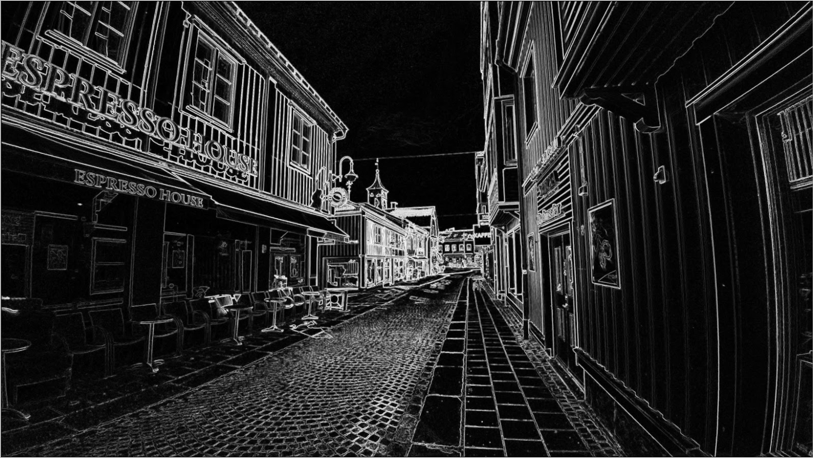
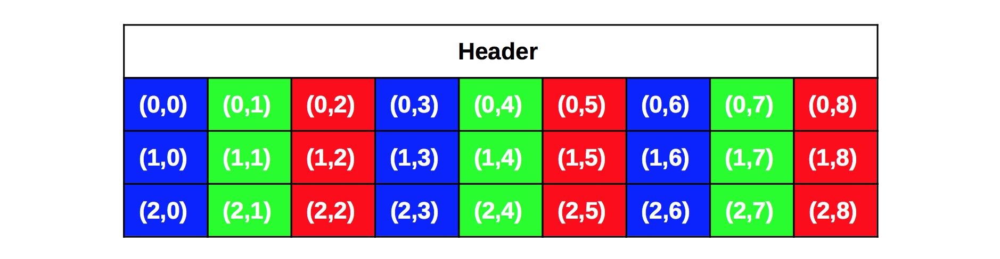
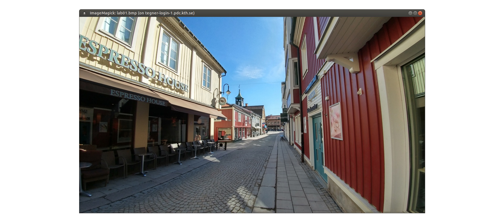
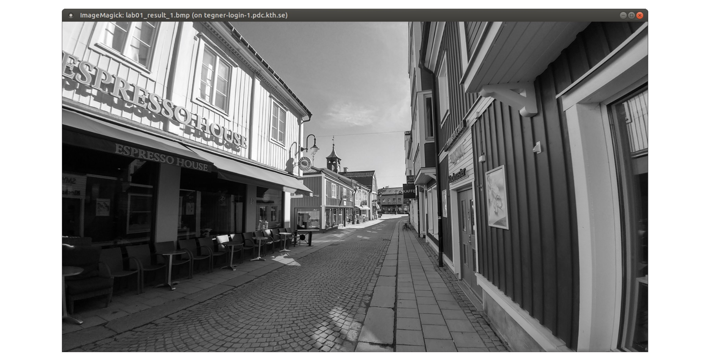
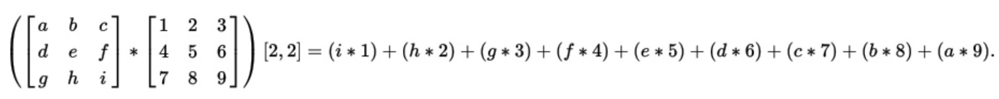
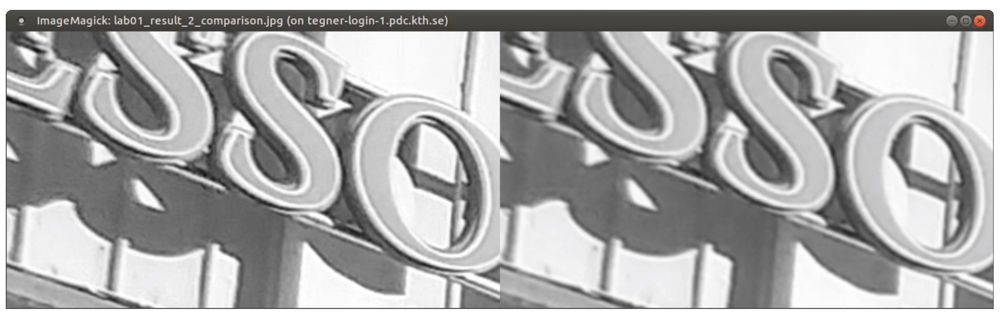
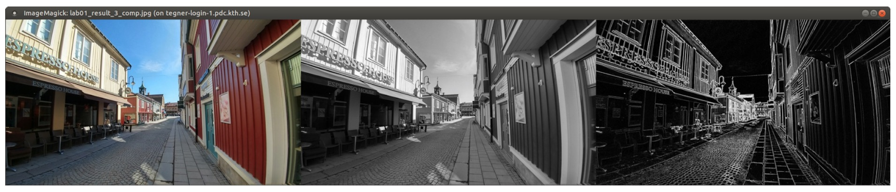
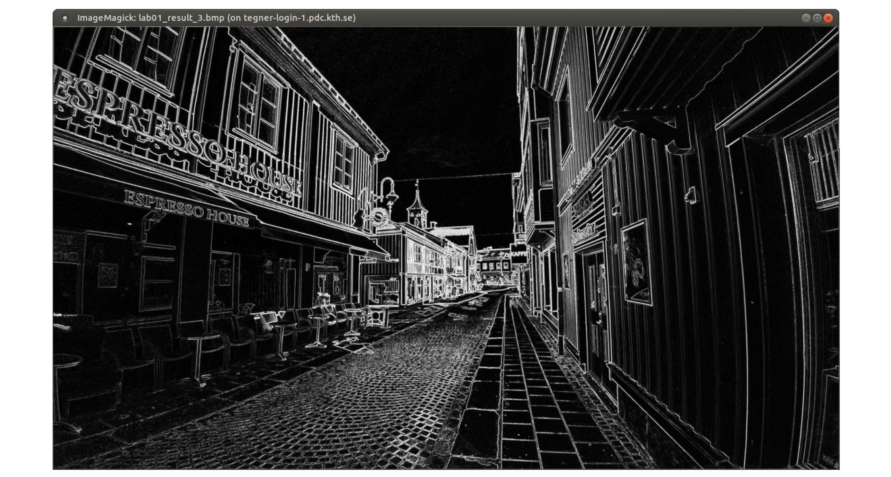
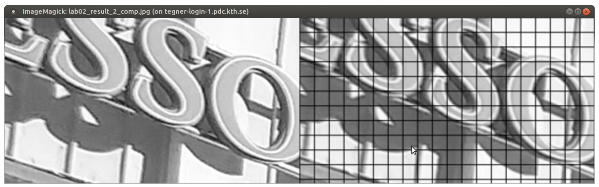

# CUDA Laboratory 2

_Introduction to High-Performance Computing_



## Introduction

In this second laboratory about GPU programming in CUDA, we are going to
continue building your skills in order to develop more advanced GPU-accelerated
applications. As a friendly reminder, the laboratory is divided in two
different blocks and exercises:

+ **Block A (Friday / 18<sup>th</sup> of August)**: The first block provided
  you with a first notion on how to use CUDA. This includes how to compile a
  CUDA program, how to launch a CUDA kernel, how to index 1D arrays, and more.

+ **Block B (Monday / 20<sup>th</sup> of August)**:The second block presents a
  use-case for using GPUs with images. The goal is to make you understand how
  to index 2D matrices, while doing something practical.

**We assume that everyone have already finished the exercises of the first block
of the laboratory session**. If you have not attempted these exercises, it will
be relatively difficult to complete the second block of exercises that we are
presenting today. The reason is that you should already understand most of the
basic concepts of CUDA presented in the first block. For instance, by now, you
must know how to compile a CUDA program, how to manage the memory of the GPU,
and (more importantly) how to implement and launch a CUDA kernel. If none of
these requirements seem familiar, please, try the first block of exercises
before proceeding!


Once again, we are going to use Tegner for the set of exercises.

> Even though you may have a laptop with a CUDA-supported GPU, we encourage you
> to use Tegner during the sessions of today and Monday.

Tegner is a cluster at KTH Royal Institute of Technology with 65 heterogeneous
nodes. Every node has one or two GPUs, based on the NVIDIA Quadro K420 or the
NVIDIA Tesla K80. For the purposes of this laboratory, we will use the "Thin
Nodes" of Tegner.  These nodes contain 2&times;12-core Intel E5-2690v3 CPUs at
2.60GHz, 512GB DRAM and NVIDIA Quadro K420 GPU per node. More information can
be found
[here](https://www.pdc.kth.se/hpc-services/computing-systems/tegner-1.737437).

In case you need help or you do not understand some of the topics of CUDA
presented in this laboratory session, do not worry, we are here to help you
out!

## Block B

For the second block of exercises, we are going to play with images and perform
some basic image processing to create the base for an edge detector, such as
[Canny](https://en.wikipedia.org/wiki/Canny_edge_detector). Our goal is to make
you understand how to index 2D matrices, while doing something fun and
practical. As a matter of fact, the results of the exercises below represent
some of the main image processing techniques used in Computer Vision that allow
for object and text recognition. If you would like to get a feeling on how the
final output would look like, check the cover of this document!

Once again, we encourage you to really understand the concepts explained within
the first block of exercises. If you do, then this block will be easy for you
to solve, as you will see.

### Exercise 3 - Experimental Setup

We will use a different CUDA source code file to implement the exercises below.
This source code file can be cloned from the repository

```
cd /cfs/klemming/nobackup/your_initial/your_username
module load git
git clone https://github.com/PDC-support/cuda-lab-exercises.git
cd cuda-lab-exercises/lab_2/C
```

We also need a reference image file to process on each step. We will use the
file ``lab02.bmp``, located inside the images folder. This file is stored using the
Bitmap (BMP) image format, a popular uncompressed format widely used by the
Windows operating system. Each BMP file contains an encoded header that
specifies the ``{width, height}`` of the image, the number of bits per color plane,
and more. After the header, a subsequent string of interleaved color values
follow (e.g., in BGR). Here is a simplified example of how a 3x3 image looks
like inside the file:



Each BGR, from Blue / Green / Red, represents an 8-bit pixel value in the image
that encodes the intensity of each channel. The values span from 0 to 255 in
the case of BMP 24bpp2, being 0 the absence of representation by this color and
255 the full representation.

> Other Bitmap formats, such as BMP 32bpp, can contain an extra Alpha channel
> for transparency.

This means that we could create a completely white image by setting all the
pixel values to 255, or the opposite, a completely black image setting them to 0.
One aspect of BMP files is that it is common to encounter that the pixel
values are stored bottom-up (i.e., as if the image pixels were flipped).

We provide you inside ``lab02_ex3_6.cu`` the functionality to read BMP 24bpp images
and retrieve the pixel data in BGR format, as single-precision floating point
values (suitable for the GPU). We also provide other set of functionality, such
as a function to store BMP 8bpp files for Black & White images. **For this block
of exercises, you will _not_ need to handle any of these aspects. We will only
ask you to implement the kernels that perform the different image processing
steps that will be applied to the reference image.** Everything else, including
the set-up of CUDA in the ``main()`` function, is already defined inside
``lab02_ex3_6.cu``.

One important aspect is to connect to Tegner using the ``-Y`` flag to enable X11
forwarding support. This flag is required because we are going to display the
resultant images using the [ImageMagick](https://www.imagemagick.org/) suite.
This is a free and open-source software suite for displaying, converting, and
editing raster image and vector image files. The suite contains multiple
interfaces (e.g., C API).

In this laboratory session, we will use the terminal interface of ImageMagick
to render the images generated by each exercise. Thus, we effectively avoid to
copy the images using ``scp``. For instance, let us resize the reference ``lab02.bmp``
image and display its content remotely. First, connect to Tegner with the ``-Y``
flag and access to the folder that contain the exercises. Then, execute the
following command:

```
display -resize 1280x720 images/lab02.bmp
```
If everything worked as expected, you must see a new window after a few seconds
(be patient):



**You are now ready to begin with the exercises!** If you did not get a new window,
please, ask any of the laboratory assistants for help.

### Exercise 4 - Black & White Image Conversion

One of the frequent initial steps in the development of an edge detector is to
discard the color information and work directly in black & white. The idea is
to keep only the intensity of the pixels. For instance, if we consider a
[YUV](https://en.wikipedia.org/wiki/YUV) color space, which is very common in
video streams, one can easily work only on the Y plane and discard the color
information. The reason is that the Y plane (luminance) contains the intensity
of the pixel values, which represents the main content of the image. The UV
planes (chrominance) define the color or tint of the pixels, but they do not
necessarily add value to the features that we want to extract from the image.

The BMP image ``lab02.bmp`` is encoded using a BGR color space, where the
combination of the individual intensities of each color value represent the
final intensity of the specific pixels. Therefore, the first step for our base
edge detector would be to combine these pixels in order to generate a BMP 8bpp
image in grayscale. In other words, we want only 8 bits per pixel.

For the conversion to grayscale, we are going to use the
[Colorimetric](https://en.wikipedia.org/wiki/Grayscale) (luminance-preserving)
method. This conversion guarantees that both the original and converted image
maintains the same absolute luminance. In practice terms, what we are going to
do is to take each BGR value of the Bitmap file and apply the following
conversion using the weighted sum of the three values:


---
**TO-DO [4.1]**

Open the file ``lab02_ex3_6.cu`` with your preferred text editor and briefly
examine the overall content of the file. Pay particular attention to the
``cpu_greyscale()`` function and try to understand how the color conversion is
done on the CPU given a BGR 24bpp image plane.

---

As you might have noticed in the ``cpu_greyscale()`` implementation, the color
conversion is relatively simple. The input image is represented as an encoded
2D image in a 1D array, where each row is consecutively stored in memory. We
retrieve the input pixel by considering each one as a BGR value (i.e.,
3&times;``float``).  In fact, the rows are separated by the ``width`` of the image
multiplied by the number of colors per pixel. On the other hand, we store the
output Y value considering that the image plane now contains only one color
value per pixel.  Once again, the output is a 2D array encoded as a 1D array.
In this case, each row is only separated from the ``width`` of the image plane.

From now on, we will use the converted image in grayscale as the input for the
subsequent operations. We now ask you to implement the same ``cpu_greyscale()``
function, but using a GPU kernel in CUDA instead.

---
**TO-DO [4.2]**

Find the declaration of ``gpu_greyscale()`` in ``lab02_ex3_6.cu`` and implement the GPU
version of the black & white color conversion filter. The source code is
already set-up to call the kernel and generate the output, but you will need to
uncomment the code inside ``main()``.

+ Hint #1: The kernel is launched with a 2D ``grid`` of 2D ``blocks``. Consider
  calculating the ID of the thread in the Y direction to select the specific
  row, and the ID of the thread in the X direction to select the specific
  column.
+ Hint #2: The boundaries of the image cannot be exceeded. You must include an
  ``if``-statement to prevent any issues, based on the ``width`` and ``height``
  parameters.

---

After you have implemented the kernel, you should be able to see the result of
the color conversion. Compile the code with ``nvcc``, ask for a node in Tegner
following the indications of the first laboratory and execute the code with
``srun``, providing the path to the input image:

```
srun -n 1 ./lab02_ex3_6.out images/lab02.bmp
```

The code will then store a new image called ``lab02_result_1.bmp`` inside the ``images``
folder. Release the allocation (``exit`` command) and visualize the result with ImageMagick:

```
display -resize 1280x720 images/lab02_result_1.bmp
```

You must get a new window that displays the converted image in black & white, such as this:



### Exercise 5 - Applying a Convolution Filter

Converting the input image to black & white was a very good first step towards
implementing our edge detector. For this exercise, we are going to apply a
Gaussian filter to smooth the grayscale image that was generated through the
kernel.

In Image Processing, a Gaussian _blur_ is the result of blurring an image by the
means of a Gaussian function. The visual effect is equivalent to looking at the
image through a translucent screen, as if the image suddenly became a thin
layer of colored candy. Depending on the intensity of the filter, the Gaussian
blur can provide multiple benefits. For instance, it can be used to reduce the
image noise. The reason is that the filter effectively reduces the
high-frequency components of a given image.

We need this filter as an intermediate step towards increasing the quality of
the result of [Exercise 6](#ex6), where we will apply a Sobel filter to define the
edges of the image (i.e., the Sobel filter is very sensitive to noise). **For
this exercise, we are going to apply a Gaussian filter using a 3&times;3
convolution matrix on all the pixels of the image.** The term convolution is the
result of adding each pixel to its local neighbours, weighted by the matrix
values:

<!---
need source
-->



The * operator represents the convolution, not a matrix multiplication.
Here, what you have to consider is to map each pixel as the center of the 3&times;3
convolution matrix and apply the weights with the surrounding pixels. As we use
symmetric filters, the order can be top-bottom as well.

---
**TO-DO [5.1]**

Find the implementation of ``cpu_applyFilter()`` inside the ``lab02_ex3_6.cu`` file and
try to understand how a given convolution matrix is applied to a certain pixel.

+ Hint #1: The input block of the image is given by the top-left corner, not
  the center of the block (the target pixel).
+ Hint #2: This is not a matrix-matrix multiplication, keep this in mind while
  reviewing the source code.

---

We already provide you with an implementation of ``cpu_gaussian()`` and
``gpu_gaussian()``, that contains the CPU and GPU implementation, respectively.
Both versions already define a 3×3 convolution filter that constitutes the
result of applying a Gaussian function to a particular pixel. Therefore, **we ask
you to implement a device function ``gpu_applyFilter()`` that allows any CUDA
kernel to apply a convolution filter given by parameter**. Remember that, in
CUDA, device functions can be declared with the ``__device__`` modifier. The syntax
is very similar to a plain C function, with the difference that now the GPU can
see this code as well.

---
**TO-DO [5.2]**

Implement the ``gpu_applyFilter()`` in ``lab02_ex3_6.cu`` that allows to apply any kind
of convolution matrix to a certain pixel. Will the GPU code differ from the CPU
code in this case? Examine the implementation of ``gpu_gaussian()`` to understand
the execution flow.

+ Hint #1: The ``gpu_applyFilter()`` is called with a single thread from
  ``gpu_gaussian()``. Do not parallelize it!
+ Hint #2: In some situations, the CPU code and the GPU code can be shared
  [https://goo.gl/Wz8iyG](https://goo.gl/Wz8iyG).

---

With the functionality for applying the convolution filter on the GPU ready, we
can now generate the second output result. Make sure you uncomment the
execution of the kernel inside ``main()``, otherwise you will not see the GPU
version enabled. Now, allocate a node on Tegner, execute with ``srun`` and then
introduce these commands:

```
montage -tile 2x1 -crop 320x180+512+512 -geometry 640x360   \
        images/lab02_result_1.bmp images/lab02_result_2.bmp \
        images/lab02_result_2_comp.jpg
display images/lab02_result_2_comp.jpg
```

The new window will display a cropped area of the original black & white image
(left), and a cropped area of the new blurred image (right). The differences
are very subtle, but you should be able to notice some differences:



If you did not manage to get any differences, please, make sure that you have
correctly enabled the new version of the ``xxx_applyFilter()`` inside the
``gpu_gaussian()`` kernel. Ask for help to the laboratory assistants if you cannot
make any progress.

### <a name="ex6"></a>Exercise 6 - Detecting Edges in the Image

The very last step of our base edge detector is to apply the Sobel filter. With
this filter, we are going to compute an approximation of the gradient of the
image intensity function. This allows us to create a new image where the edges
are emphasized, which constitutes the base for full edge detection algorithms
such as [Canny](https://en.wikipedia.org/wiki/Canny_edge_detector).

The filter uses two 3×3 kernels which are convolved with the original image
to calculate approximations of the derivatives on the horizontal and vertical
directions. In other words, if we define **A** as the source image, and **G**_x_ and **G**_y_
as two convolution matrices that generate the horizontal and vertical
derivative approximations, the computations are as follow:

<!---
need source
-->


The resultant gradient magnitude of the pixel is obtained by calculating the
square root of these:


For the last exercise, we want you to implement the GPU version of ``cpu_sobel()``,
which is already declared in ``lab02_ex3_6.cu`` under the name ``gpu_sobel()``. The
implementation of this function is very similar to ``gpu_gaussian()``, except for
the fact that the we apply two different convolution filters to the same pixel
and combine the result.

---
**TO-DO [6.1]**

Implement ``gpu_sobel()`` in ``lab02_ex3_6.cu`` to enable the execution of the Sobel
filter on the GPU. Pay special attention to the indices used on the CPU
implementation ``cpu_sobel()`` to avoid any issues with the final result.

+ Hint #1: You can use the ``sqrtf()`` function to calculate the square root, as in
  the CPU code.
+ Hint #2: It might be interesting for you to examine first how ``gpu_gaussian()``
  has been implemented.

With the implementation of ``gpu_sobel()`` in place, we are almost done with the
laboratory session of today. Make sure you uncomment the execution of the
kernel inside ``main()``, execute the application with srun, and open the result
with the following two commands:

```
montage -border 0 -geometry 640x360 -tile 3x1      \
        images/lab02.bmp images/lab02_result_1.bmp \
        images/lab02_result_3.bmp images/lab02_result_3_comp.jpg
display images/lab02_result_3_comp.jpg
```

A new window will open that displays the original image (left), the black &
white image (center), and finally the result of applying the Gaussian and Sobel
filters (right):



You can also observe how the result image looks like in larger resolution. Use
the display command in combination with the resize flag:

```
display -resize 1280x720 images/lab02_result_3.bmp
```

Alternatively, you can remove the "``-resize 1280x720``" option to
visualize a full resolution of the image. This might take some time to load,
but it might be worth it to consider all the small details. Whether you resize
the image or not, you should observe something like the following:



**If you reached this point, you can consider yourself a CUDA master!** We hope
that you enjoyed the laboratory session.

## Bonus Exercises

In this section, we provide you with additional exercises with the purpose of
getting deeper into CUDA optimizations. These exercises are optional, but we
consider that advanced users might be interested in understanding how they
could improve the performance of their applications.

### Exercise 7 - Optimizing Memory Accesses

During the lectures, we have seen that the memory hierarchy of the GPU is rich
and complex. We can encounter different layers that vary in speed and
capacity. For instance, the texture memory is a very limited and special memory
that allows you for efficient access to random locations inside a texture,
which is tremendously useful in video games.

This hierarchy is also visible from a CUDA program perspective, and effectively
selecting where to place our data can make a difference in some situations. Up
until now, we have been using the Global Memory space, which is provided by
default if nothing is specified. This Global Memory offers very high-capacity
and represents the first layer we access when copying data from the CPU to the
GPU. Unfortunately, this memory features high-latency to access the data.

In this exercise, we are going to try to optimize the GPU versions of the
Gaussian and Sobel filter by using the Shared Memory instead. The idea is to
bring the content of the image from Global Memory to Shared Memory in blocks of
size ``BLOCK_SIZE_SH``. This constant is also the dimension of each ``block`` inside
the ``grid``, plus some additional values in X and Y.

We ask you first to declare the ``BLOCK_SIZE_SH`` constant on top of the file, which
defines the dimension of the Shared Memory block. Use the following:

```
#define BLOCK_SIZE_SH 18
```

> We will provide more details of why we use 18 here and not 16, as in the
> number of threads per block.

We will use this constant for the declaration of the memory space inside
``gpu_gaussian()`` and ``gpu_sobel()``. The declaration is defined in the first
or one of the first lines of each kernel:

```
__shared__ float sh_block[BLOCK_SIZE_SH * BLOCK_SIZE_SH];
```

This will declare a 2D shared block in Shared Memory, using the 1D array
representation that we have already discussed in the previous exercises. The
``__shared__`` attribute is given in the declaration to suggest the compiler that
we want this variable to be located in Shared Memory and not in Local or Global
Memory.

Hence, the first exercise would be to declare the shared block inside
``gpu_gaussian()`` and ``gpu_sobel()``. Then, we ask you to make each thread copy a
pixel from the input image into the shared memory block. You have to call
``__syncthreads()`` to guarantee that each thread has finished retrieving its part
of the block before using the data. Thereafter, change the input of the
``applyFilter()`` function to use the shared block instead.

---
**TO-DO [B2.1]**

In ``lab02_ex3_6.cu``, declare a Shared Memory block within ``gpu_gaussian()`` and
another one within ``gpu_sobel()``. Thereafter, introduce the necessary changes to
make each thread bring one pixel value to the shared block. Change the input
parameter of applyFilter() to use the shared block (i.e., instead of a
reference to the input image directly).

+ Hint #1: Use ``__syncthreads()`` to guarantee that all the threads have copied
  their pixels to the Shared Memory.

---

If you have implemented it "correctly", you will observe that the output result
is not exactly what you expected it to be. You should see by now something like
this, in the case of the Gaussian filter and the side-by-side comparison with
the original image:



The reason is that the exercise is a little bit more complex than initially one
might expect. With the change that you just introduced, we are not considering
the fact that we also have to bring extra columns and rows on one of the sides
of the block. Without this change, some of the threads are accessing
uninitialized data.

This is the main reason why we declared the constant ``BLOCK_SIZE_SH`` with two
additional elements per dimension. This will make sure that all the threads
within the block access data that is available inside the Shared Memory space.
As such, **the final exercise for you would be to consider the boundaries of each
thread block**. We already gave you a hint in the declaration of the constant
``BLOCK_SIZE_SH`` (i.e., two extra columns and rows are needed).

---
**TO-DO [B2.2]**

Extend the Shared Memory version of ``gpu_gaussian()`` and ``gpu_sobel()`` to transfer
part of the surrounding pixels of the thread block to Shared Memory. Make sure
that you do not exceed the boundaries of the image.

+ Hint #1: Once again, use ``__syncthreads()`` to guarantee that all the threads
  have copied their pixels to the Shared Memory. You will need more than one call
  to this function.

---

After your implementation is completed, you will see that the execution time
has been reduced around 5-10ms, compared to the original implementation. The
output should state something as:

```
Step #1 Completed - Result stored in "images/lab02_result_1.bmp".
Elapsed CPU: 52ms / Elapsed GPU: 16ms
Step #2 Completed - Result stored in "images/lab02_result_2.bmp".
Elapsed CPU: 270ms / Elapsed GPU: 19ms
Step #3 Completed - Result stored in "images/lab02_result_3.bmp".
Elapsed CPU: 570ms / Elapsed GPU: 20ms
```

Despite this might not seem as a major achievement, this change represents
between 15% to 30% performance improvement. In fact, in real-time rendering
such as in games, saving 5ms could make a huge difference in performance. Here,
the limit per frame is usually around 16ms for 60FPS or 33ms for 30FPS. Hence,
game developers usually fight for any slight optimization of the code that
could make them achieve these rates.

Nonetheless, **we must note that this was a very naive implementation**. We just
wanted you to try how you could define a Shared Memory space in the GPU, as a
fine grain performance optimization. However, we did not account for other
issues, such as memory bank conflicts, that could boost the performance
considerably. In fact, we could have combined the Gaussian and Sobel filters to
exploit data locality. Advanced users might be interested in reading the
following article from NVIDIA: [https://goo.gl/1WuZGy](https://goo.gl/1WuZGy).
